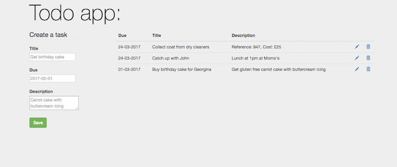

Todo web app 
=================================

This is a CRUD web application where the user can create, edit and delete tasks which are displayed back to the user as a list. It uses the MVC pattern and tasks are stored persistently in a MongoDB database.

### Key features
- Used the [DAO pattern](https://github.com/muhsinali/todo-app/blob/master/app/dao/TaskDAO.scala) to provide an interface to the MongoDB database; decouples the persistence layer from the application layer
- Tasks are [programmatically loaded](https://github.com/muhsinali/todo-app/blob/92661a9208c5f3490227725225e7c8ccf345288a/app/services/ApplicationInterceptor.scala#L29-L40) into a MongoDB database at application startup
- Made use of GitFlow and created a continuous deployment pipeline using Travis and Heroku

### Tech stack
- Scala 2.11.8
- Play framework (version 2.5.12)
- MongoDB (ReactiveMongo 0.12.1)
- HTML, CSS, Bootstrap 3, [Twirl template engine](https://www.playframework.com/documentation/2.5.x/ScalaTemplates)

Future work
=================================
- Add user authentication
- Use web sockets
